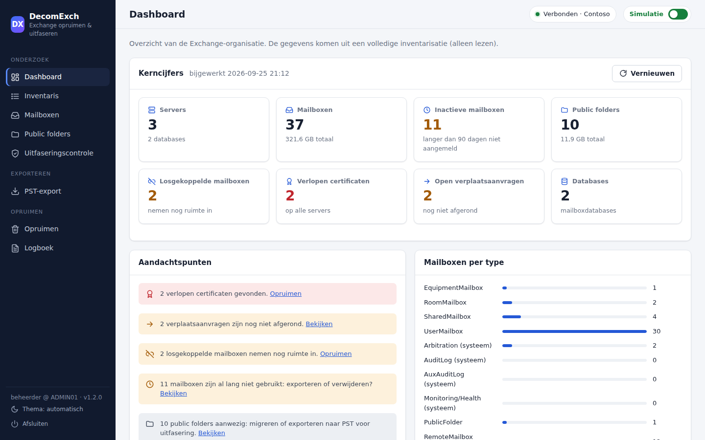

# DecomExch

PowerShell-tool om een bestaande on-premises Exchange-server (2013/2016/2019/SE) te **onderzoeken**,
erover te **rapporteren**, mailboxen en public folders te **exporteren naar PST**, en de server
op te **ruimen** en **veilig uit te faseren**. Werkt vanuit de Exchange Management Shell, met een
interactief menu of volledig via parameters (voor geplande taken).

## Webinterface

```powershell
.\DecomExch.ps1 -Action Web
```

Start een lokale webinterface in de browser met een dashboard, doorzoekbare en sorteerbare tabellen,
de uitfaseringscontrole, PST-export en opruimacties. Alles wat het menu kan, kan ook de webinterface.



- **Dashboard** met kerncijfers en aandachtspunten (verlopen certificaten, inactieve mailboxen, open aanvragen).
- **Mailboxen** en **public folders**: zoeken, filteren, sorteren, selecteren en direct doorsturen naar de PST-export.
- **Uitfaseringscontrole** met een duidelijk oordeel per server en de oplossing per punt.
- **PST-export** met voortgangsbalken per exportaanvraag.
- **Opruimen**: altijd eerst simuleren; in LIVE-modus moet elke actie met `JA` worden bevestigd.
- Elke tabel is te downloaden als CSV of op te slaan als HTML-rapport; licht en donker thema.

Veiligheid van de webinterface:

- De webserver luistert alleen op `http://localhost` (standaard poort 8765, aan te passen met `-Port`).
  Is de poort bezet, bijvoorbeeld door een webinterface die nog in een ander venster draait, dan wordt
  automatisch de volgende vrije poort gebruikt; de console toont de juiste link.
- Elke sessie krijgt een geheim token in de link; zonder dat token worden API-verzoeken geweigerd.
- Inloggegevens (`-Credential`) blijven in PowerShell; de webinterface toont alleen de accountnaam.
- De interface start altijd in **simulatiemodus**. De server weigert echte opruimacties zonder `JA`-bevestiging.
- Geen externe bibliotheken of CDN's: werkt ook op servers zonder internettoegang.
- Stoppen met Ctrl+C in de console of de knop **Afsluiten** in de interface.

De webserver draait in de PowerShell-sessie en gebruikt de Exchange-verbinding daarvan; acties worden
een voor een uitgevoerd. Grote inventarisaties kunnen enkele minuten duren.

## Vanaf een beheerlaptop (remote)

DecomExch hoeft niet op de Exchange-server zelf te draaien. Start het op je laptop en verbind remote
met de server; de Exchange-beheertools zijn daarvoor niet nodig.

```powershell
# Met je huidige Windows-account
.\DecomExch.ps1 -Action Web -ExchangeServer ex01.contoso.local

# Met een ander account (vraagt om het wachtwoord)
.\DecomExch.ps1 -Action Web -ExchangeServer ex01.contoso.local -Credential contoso\beheerder
```

- Werkt ook met het menu en de niet-interactieve acties (`-Action Inventory`, `CleanLogs`, ...).
- Gebruik de volledige servernaam (FQDN); de verbinding loopt via `http://<server>/PowerShell`
  (poort 80) met Kerberos. Exchange accepteert standaard alleen Kerberos; `-Authentication Negotiate`
  of `Basic` werkt alleen als dat op de server is ingeschakeld.
- Vanaf een laptop buiten het domein kan Kerberos met `-Credential` werken als de laptop de
  domeincontrollers en de Exchange-server op naam kan bereiken; lukt dat niet, gebruik dan een
  laptop of beheerserver in het domein.
- De inloggegevens blijven alleen in het geheugen van de PowerShell-sessie. Ze worden ook gebruikt om
  logbestanden via `\\server\C$` op te ruimen (het account moet lokale beheerder zijn op de server en
  SMB, poort 445, moet bereikbaar zijn) en bij opnieuw verbinden vanuit de webinterface. Het wachtwoord
  gaat nooit via de browser.
- Public folders naar PST exporteren gaat via Outlook op de laptop zelf, met het Outlook-profiel.

### Problemen met verbinden

| Melding | Oorzaak en oplossing |
|---|---|
| `0x80090311` / *your domain isn't available* | De laptop kan geen domeincontroller van het domein van het account bereiken; Kerberos heeft die nodig. Maak verbinding met het netwerk of de VPN van de organisatie en controleer DNS (`nltest /dsgetdc:<domein>`). Of start DecomExch op een computer in het domein of op de Exchange-server zelf. |
| *Kerberos ... implicit credentials ... not joined to a domain* | De laptop zit niet in het domein: geef een account op met `-Credential <domein>\<gebruiker>`. |
| *HTTP bad request status (400)* met `Negotiate` of `Basic` | Exchange accepteert voor remote PowerShell standaard alleen Kerberos. Verbind met Kerberos (zie de eerste regel). |
| *TrustedHosts* | Alleen nodig zonder Kerberos. Controleer eerst `Get-Item WSMan:\localhost\Client\TrustedHosts`: staat daar `*`, dan is het al goed; is het leeg, gebruik `Set-Item WSMan:\localhost\Client\TrustedHosts -Value <server> -Force` (met `-Concatenate` als er al andere servers staan). |
| *Access is denied* | Verkeerd wachtwoord, of het account is geen Exchange-beheerder of mag geen remote PowerShell gebruiken. |

In de webinterface kies je de aanmeldmethode in het venster **Verbinden**; de inloggegevens van
`-Credential` worden daarbij hergebruikt, ook als de eerste poging bij het starten mislukte.

## Wat kan het?

**Onderzoek en rapportage** (alleen lezen, uitvoer als HTML-rapport + CSV)

| # | Onderdeel |
|---|-----------|
| 1 | **Volledige inventarisatie**: servers, databases, mailboxen per type (incl. arbitration/audit/public folder), mailboxoverzicht, public folders, losgekoppelde mailboxen, aanvragen, migratiebatches, connectors, domeinen, adresbeleid, certificaten, Autodiscover, hybride configuratie. |
| 2 | **Mailboxoverzicht**: per mailbox grootte, aantal items, archief, laatste aanmelding en of de mailbox *inactief* is (standaard > 90 dagen niet aangemeld). |
| 3 | **Public folder-overzicht**: pad, aantal items, grootte, laatste wijziging en mail-enabled adres. |
| 4 | **Relaygebruik**: wie verstuurt nog mail via de server, hoe vaak, en hoe (aanmelding, TLS, connector, interne of externe ontvangers). Zie [Relaygebruik](#relaygebruik). |
| 5 | **Uitfaseringscontrole** per server, met per punt *OK / Info / Waarschuwing / Blokkerend* en de oplossing. |
| 6 | **Hybride koppeling** met Exchange Online in kaart brengen: onderdelen, voorwaarden (mailboxen, migraties, MX, Autodiscover) en de handmatige stappen. Zie [Hybride koppeling opruimen](#hybride-koppeling-opruimen). |

**Exporteren naar PST**

| # | Onderdeel |
|---|-----------|
| 7 | **Mailboxen exporteren**: alle mailboxen, per database of een selectie, optioneel inclusief online archief (`<alias>.pst` en `<alias>_Archief.pst`). |
| 8 | **Public folders exporteren** (met submappen) naar een PST, via Outlook. |
| 9 | **Status van PST-exports** met voortgang per aanvraag. |

**Opruimen** (wijzigt iets, altijd eerst simuleren)

| # | Onderdeel |
|---|-----------|
| 10 | **Logbestanden**: Exchange `Logging`, Search `ETLTraces`/`Logs` en IIS-logs ouder dan N dagen. Transactielogs en databasemappen worden altijd overgeslagen. |
| 11 | **Afgeronde aanvragen**: move-, export-, import- en restore-aanvragen en migratiebatches. Lopende aanvragen worden nooit aangeraakt. |
| 12 | **Losgekoppelde mailboxen** (Disabled/SoftDeleted) definitief verwijderen (onomkeerbaar). |
| 13 | **Verlopen certificaten**. Gekoppelde certificaten en het OAuth-certificaat worden overgeslagen. |
| 14 | **Hybride koppeling opruimen** aan de on-premises kant, met back-up vooraf. |

### Controles bij uitfasering

- Laatste Exchange-server in de organisatie? (advies: Exchange Management Tools bij hybride/directory sync)
- DAG-lidmaatschap
- Mailboxdatabases op de server
- Gebruikers-, arbitration-, AuditLog-, AuxAuditLog-, public folder- en health-mailboxen
- Lopende of afgeronde verplaatsaanvragen
- Send connectors waarvan de server (enige) bronserver is
- Eigen (niet-standaard) receive connectors, bijv. relay voor printers/applicaties
- Edge-abonnementen
- Autodiscover SCP (`AutoDiscoverServiceInternalUri`)
- Hybride verzend-/ontvangstservers en remote mailboxen

## Veiligheid

- Het menu start altijd in **simulatiemodus**: exports en opruimacties draaien met `-WhatIf` en tonen
  alleen wat er zou gebeuren.
- Zet je de simulatiemodus uit (`S`), dan moet je elke opruimactie bevestigen door `JA` te typen.
- Bij gebruik via parameters wordt alleen echt geexporteerd of gewijzigd met `-Execute`.
- Alle functies die iets verwijderen of exporteren ondersteunen `-WhatIf` en `-Confirm`.
- Elke sessie schrijft een logbestand naar `Output\Logs`.

## Hybride koppeling opruimen

Staan alle mailboxen in Exchange Online, dan kan de koppeling die de Hybrid Configuration Wizard (HCW)
heeft gemaakt weg. DecomExch zoekt de onderdelen on-premises op en ruimt ze in een veilige volgorde op
(menu 6 en 14, webpagina **Hybride koppeling**, of `Get-DxHybridReport` / `Remove-DxHybridConfiguration`):

| Onderdeel | Actie |
|-----------|-------|
| IntraOrganizationConnector (`HybridIOC - ...`) | verwijderen |
| Organization relationship met Exchange Online (`On-premises to O365 - ...`) | verwijderen |
| Send connector naar Exchange Online (`Outbound to Office 365 - ...`) | verwijderen; een connector voor *alle* mail via Exchange Online is optioneel |
| Remote domain `Hybrid Domain - tenant.mail.onmicrosoft.com` | verwijderen |
| TLS-instelling `AcceptCloudServicesMail` op receive connectors | weghalen (certificaat blijft) |
| Federated organization identifier en federation trust | uitschakelen / verwijderen; optioneel als een andere organisatie de federatie nog gebruikt |
| OAuth: auth servers (ACS/EvoSts) en partner application *Exchange Online* | uitschakelen (terug te draaien) |
| Autodiscover SCP | optioneel leegmaken |
| Object `HybridConfiguration` | verwijderen |
| Accepted domain `tenant.mail.onmicrosoft.com` | **blijft staan** (remote mailboxen en adresbeleid) |

Veiligheid:

- Eerst simuleren; bij een echte uitvoering komt er eerst een back-up (`Export-Clixml` + tekst) in `Output\Backup`.
- Zijn er nog mailboxen of lopende migraties on-premises, dan stopt het opruimen (tenzij `-Force` /
  *Toch uitvoeren* is gekozen): zonder koppeling werken mailflow en free/busy tussen beide kanten niet meer.
- MX en Autodiscover worden gecontroleerd (vanaf de computer waar DecomExch draait).

Daarna handmatig, buiten de on-premises organisatie (het rapport geeft de opdrachten). Doe de stappen
voor Exchange Online in een **nieuw PowerShell-venster**, niet in de Exchange Management Shell of het venster
van DecomExch: beide omgevingen hebben cmdlets met dezelfde naam. Installeer eenmalig de module
(`Install-Module ExchangeOnlineManagement -Scope CurrentUser`) en verbind met een Microsoft 365-beheeraccount
(`Connect-ExchangeOnline -UserPrincipalName ...`; lukt het aanmelden niet, voeg dan `-DisableWAM` toe of gebruik `-Device`).
Verder: DNS (MX,
Autodiscover, SPF), in Exchange Online de connectors `Inbound from ...`/`Outbound to ...`, de organization
relationship `O365 to On-premises - ...`, de `HybridIOC` en migratie-endpoints, en eventueel de Hybrid Agent.
Laat Entra Connect gebruikers synchroniseren en beheer ontvangers met de Exchange Management Tools.

```powershell
.\DecomExch.ps1 -Action HybridReport
.\DecomExch.ps1 -Action CleanHybrid            # simulatie
.\DecomExch.ps1 -Action CleanHybrid -Execute   # echt, met back-up
```

## Relaygebruik

Voordat een server weg kan, moet duidelijk zijn welke applicaties, scanners, printers en servers er
nog mail via versturen. **Relaygebruik** leest de SMTP-logs en vat het verkeer samen per client:

- **Hoe vaak**: aantal berichten en sessies, eerste en laatste keer, berichten per dag.
- **Door wie**: IP-adres, naam (EHLO en optioneel DNS), soort client (intern apparaat/applicatie,
  extern op internet, Exchange Online), afzenders en het account waarmee is aangemeld.
- **Hoe**: connector en poort, anoniem of met aanmelding, TLS, en of er naar externe adressen wordt
  verstuurd (echte relay).

Daarnaast toont de pagina alle receive connectors, en of daarop protocol logging aanstaat.

| Bron | Wat je ziet | Voorwaarde |
|---|---|---|
| **SMTP-protocollogs** (`RECV*.log`) | Alles, inclusief aanmelding, TLS, EHLO-naam, connector en poort | Protocol logging `Verbose` op de receive connector; remote via `\\server\C$` |
| **Message tracking** | Aantallen, IP-adres, afzenders en ontvangers; geen aanmelding of TLS | Staat standaard aan; werkt via remote PowerShell |
| **Map met logbestanden** | Hetzelfde als de protocollogs | Gekopieerde `RECV*.log`-bestanden; geen Exchange-verbinding nodig |

`Automatisch` gebruikt de protocollogs als die er zijn, en anders message tracking. De protocollogs
staan standaard in `<Exchange>\TransportRoles\Logs\FrontEnd\ProtocolLog\SmtpReceive` en
`...\Hub\ProtocolLog\SmtpReceive`. Verkeer tussen Exchange-servers wordt niet meegeteld; zonder
Exchange-verbinding worden die herkend aan poort 2525 en `X-ANONYMOUSTLS`.

Staat protocol logging uit op een eigen (relay-)connector, zet het dan eerst aan en wacht een paar
dagen:

```powershell
Set-ReceiveConnector -Identity 'EX01\Relay scanners' -ProtocolLoggingLevel Verbose
```

```powershell
# Webinterface: pagina Relaygebruik. Of vanaf de opdrachtregel:
.\DecomExch.ps1 -Action RelayReport -Days 14
.\DecomExch.ps1 -Action RelayReport -LogPath D:\Logs\SmtpReceive -Domain contoso.nl,contoso.com -Days 0

# Als module
Get-DxRelayUsage -Days 7 | Where-Object Type -eq 'Intern (applicatie/apparaat)' |
    Format-Table Client, Naam, Berichten, Aanmelding, TLS, ExterneOntvangers, Afzenders
Get-DxReceiveConnectorReport | Where-Object Advies
```

Grote logbestanden kosten tijd: reken op ongeveer 20.000 logregels per seconde. Beperk de periode
met `-Days` als dat te lang duurt.

## Exporteren naar PST

### Mailboxen

De export gebruikt `New-MailboxExportRequest`: de Exchange-server schrijft de PST zelf weg. Daarom:

1. Maak een share aan, bijv. `\\fs01\pst$`, en geef de groep **Exchange Trusted Subsystem**
   lees- en schrijfrechten (share en NTFS).
2. Ken jezelf de rol **Mailbox Import Export** toe en open daarna de shell opnieuw:
   ```powershell
   New-ManagementRoleAssignment -Role 'Mailbox Import Export' -User beheerder
   ```
3. Gebruik altijd een UNC-pad; een lokaal pad (`D:\PST`) wordt geweigerd.

Tip: gebruik eerst het **mailboxoverzicht** om te zien hoeveel ruimte de export nodig heeft en welke
mailboxen inactief zijn. Volg de voortgang met menu-optie 7 (of `Get-DxPstExportStatus -Wait`) en ruim
afgeronde exportaanvragen daarna op met menu-optie 9.

### Public folders

Exchange heeft geen ondersteunde cmdlet om public folders naar PST te exporteren. DecomExch gebruikt
daarom **Outlook**: er wordt een PST aan het Outlook-profiel gekoppeld, de gekozen mappen worden er
(met submappen) in gekopieerd en de PST wordt weer ontkoppeld.

- Voer dit uit op een werkstation of beheerserver **met Outlook (desktop)**, niet op de Exchange-server.
- Het Outlook-profiel moet van een account zijn met leesrechten op de public folders.
- Exchange-cmdlets zijn hiervoor niet nodig; het menu werkt ook zonder Exchange-verbinding.
- Outlook opent standaard PST-bestanden tot 50 GB; exporteer grote hoeveelheden per map
  (`-PublicFolder '\Afdelingen\Verkoop'`).
- Het kopieren is synchroon en kan bij grote mappen lang duren.

## Vereisten

- Windows PowerShell 5.1 met de Exchange Management Shell, of een remote verbinding (`-ExchangeServer`,
  eventueel met `-Credential`) vanaf bijvoorbeeld een beheerlaptop.
- Rol *Organization Management*.
- Voor het opruimen van logs op een andere server: lokale beheerder op die server (toegang via `\\server\C$`).
- Voor PST-export: zie hierboven (rol *Mailbox Import Export*, share, en Outlook voor public folders).

## Gebruik

```powershell
# Interactief menu (in de Exchange Management Shell)
.\DecomExch.ps1

# Webinterface in de browser
.\DecomExch.ps1 -Action Web
.\DecomExch.ps1 -Action Web -Port 9000 -NoBrowser

# Remote verbinden met een Exchange-server
.\DecomExch.ps1 -ExchangeServer ex01.contoso.local

# Inventarisatie en mailboxoverzicht naar een map
.\DecomExch.ps1 -Action Inventory -OutputPath D:\DecomExch
.\DecomExch.ps1 -Action MailboxReport -InactiveDays 180

# Uitfaseringscontrole voor EX01
.\DecomExch.ps1 -Action Readiness -Server EX01

# Mailboxen naar PST: eerst simuleren, daarna echt uitvoeren
.\DecomExch.ps1 -Action ExportMailboxes -PstPath \\fs01\pst$ -IncludeArchive
.\DecomExch.ps1 -Action ExportMailboxes -PstPath \\fs01\pst$ -IncludeArchive -Execute
.\DecomExch.ps1 -Action ExportMailboxes -Mailbox jan@contoso.com, info@contoso.com -PstPath \\fs01\pst$ -Execute
.\DecomExch.ps1 -Action PstStatus

# Public folders naar PST (op een werkstation met Outlook)
.\DecomExch.ps1 -Action ExportPublicFolders -PublicFolder '\' -PstPath D:\PST -Execute

# Logbestanden ouder dan 30 dagen opruimen
.\DecomExch.ps1 -Action CleanLogs -Server EX01 -OlderThanDays 30 -Execute
```

Acties: `Web`, `Inventory`, `MailboxReport`, `RelayReport`, `PublicFolderReport`, `Readiness`, `HybridReport`, `ExportMailboxes`, `ExportPublicFolders`,
`PstStatus`, `CleanLogs`, `CleanRequests`, `CleanDisconnectedMailboxes`, `CleanCertificates`, `CleanHybrid`.

De functies zijn ook los te gebruiken als module:

```powershell
Import-Module .\src\DecomExch\DecomExch.psd1
Test-DxDecomReadiness -Server EX01 | Format-Table -AutoSize -Wrap
Get-DxMailboxReport | Where-Object Inactief | Sort-Object GrootteMB -Descending
Get-DxMailboxReport | Where-Object Inactief | Export-DxMailboxToPst -FilePath \\fs01\pst$ -IncludeArchive -WhatIf
Get-DxPstExportStatus -Wait
Remove-DxStaleRequest -IncludeFailed -WhatIf
Get-DxInventory | Export-DxReport -Path D:\DecomExch
```

Tip: plan `CleanLogs` als dagelijkse taak op elke Exchange-server:

```powershell
powershell.exe -NoProfile -ExecutionPolicy Bypass -File C:\DecomExch\DecomExch.ps1 -Action CleanLogs -Server %COMPUTERNAME% -OlderThanDays 14 -Execute
```

## Stappenplan uitfaseren (samengevat)

1. **Inventarisatie** maken en bewaren als nulmeting; bepaal met het mailbox- en public folder-overzicht
   wat bewaard moet worden. Bekijk met **Relaygebruik** welke applicaties en apparaten nog mail via
   de server versturen.
2. Wat bewaard moet worden maar niet wordt gemigreerd **exporteren naar PST**.
3. **Uitfaseringscontrole** draaien voor de server.
4. Blokkerende punten oplossen: mailboxen/systeemmailboxen verplaatsen, server uit de DAG halen,
   send connectors aanpassen, relay-klanten omzetten, Autodiscover SCP leegmaken.
5. Opruimen: afgeronde aanvragen, losgekoppelde mailboxen, verlopen certificaten, lege databases.
   Staan alle mailboxen in Exchange Online: **hybride koppeling opruimen** (en de stappen in Exchange Online).
6. DNS (MX, Autodiscover, SPF), firewall/NAT en load balancer bijwerken.
7. Server enkele dagen **uitgeschakeld** laten staan en logs controleren op resterend verkeer.
8. Exchange verwijderen via *Programs and Features* of `Setup.exe /mode:Uninstall
   /IAcceptExchangeServerLicenseTerms_DiagnosticDataOFF`.
   Bij de laatste server met hybride/directory sync: niet verwijderen, maar overstappen op de
   Exchange Management Tools.
9. Server uit het domein halen en DNS-records en AD-computeraccount opruimen.

## Tests

De tests gebruiken stubs voor de Exchange-cmdlets en een nagebootste Outlook-omgeving, en draaien dus
zonder Exchange of Outlook (Pester 4.10+ of 5):

```powershell
Invoke-Pester -Path .\tests
```

## Structuur

```
DecomExch.ps1                 Menu, webinterface en niet-interactieve acties
src/DecomExch/                PowerShell-module
  Web/                        Webinterface (HTML, CSS, JavaScript; geen externe afhankelijkheden)
  Public/                     Get-DxInventory, Get-DxMailboxReport, Export-DxMailboxToPst, ...
  Private/                    Hulpfuncties (logging, UNC-paden, API-routes van de webinterface, ...)
tests/                        Pester-tests en Exchange-stubs
```
